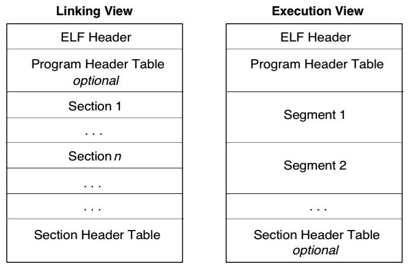
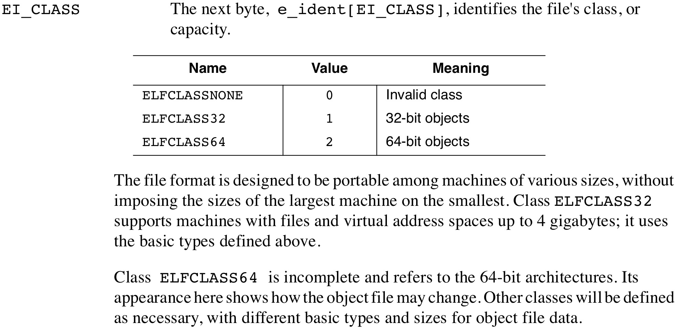

#<center>_Executable and Link Format_</center>
***
## _Aufgabenstellung_
1. Wie findet man (bzw. das Betriebssystem) die erste auszuführende Instruktion innerhalb des Text-Segments?
2. Auf welche Weise bekommen bereits im Quellprogramm (z.B. C-Programm) initialisierte - d.h. mit einem Anfangswert versehene – Variable ihre Anfangswerte vor dem Start eines Programmes?
3. Woran erkennt man, um welchen Typ einer in ELF dargestellten Datei es sich handelt? (Für welche Dateitypen ist ELF prinzipiell vorgesehen?)
4. Unterscheiden sich ELF-Dateien für 32-Bit- und 64-Bit-Prozessorarchitekturen? (Woran ist das gegebenenfalls erkennbar?)
5. Welchen Zweck haben die so genannten Sektionen (sections) bzw. die program headers?
6. Welche Bedeutung hat eine Symboltabelle als Teil einer in ELF dargestellten Datei?

***

## <center>_Was ist ELF?_</center>
- Executable and Link Format
- Standardformat für Binärprogramme in UNIX Systemen

### _Besonderheiten_
- dynamisches Linken und Laden
- Kontrolle über bereits laufende Programme
- einfache Möglichkeit, dynamische Bibliotheken zu erzeugen
- ELF stellt ein Framework bereit, welches verschiedene Prozessoren und Datenformatierungen unterstützt
	- die ersten Bytes der Datei geben an, wie die Datei zu interpretieren ist, unabhängig von der Prozessorart oder des restlichen Inhalts der Datei

### _Aufbau_
**besteht aus 5 Teilen**:
- Kopfinformationen (==ELF Header==)
- Programmkopftabelle (==program header table==)
- Sektionskopftabelle (==section header table==)
- Sektionen (==ELF sections==)
- Segmente (==ELF segment==)

### _Dateitypen_
#### relocatable file
- beinhaltet Informationen, wie Objektdateien verlinkt werden sollen, um ein Programm oder eine dynamische Bibliothek zu erzeugen

```
Relocation is the process of connecting symbolic references with symbolic
definitions. For example, when a program calls a function, the associated 
call instruction must transfer control to the proper destination address 
at execution. In other words, relocatable files must have information that
describes how to modify their section contents, thus allowing executable 
and shared object files to hold the right information for a process's 
program image. Relocation entries are these data.
```

#### executable file
- beinhaltet Informationen, wie das Programm ausgeführt werden soll

#### shared object file
- Informationen für das statische und dynamische Linken



***

#### ELF Header
- beschreibt den Aufbau der Datei

#### Program Header Table
- Informationen zur Prozesserzeugung
- nicht benötigt bei relocatable files

```

An executable or shared object file's program header table is an array 
of structures, each describing a segment or other information the system 
needs to prepare the program for execution. An object file segment 
contains one or more sections. Program headers are meaningful only for
executable and shared object files. A file specifies its own program 
header size with the ELF header's e_phentsize and e_phnum members

```

#### Sections (Linking View)
- beinhalten die Object File Informationen
	- instructions
	- data
	- symbol table
	- relocation information

#### Segments (Execution View)
- nötige Informationen zur Ausführung des Programms

#### Section Header Table
- beschreibt die Sections der Datei und wo sie zu finden sind
	- jede Section hat einen Eintrag:
		- section name
		- section size
		- etc.
- nicht benötigt bei executable files

***

### Program Loading
Program loading is the process by which the operating system creates or augments a process image. The manner in which this process is accomplished and how the page management functions for the process are handled are dictated by the operating system and processor.

### Dynamic Linking
The dynamic linking process resolves references either at process initialization time and/or at execution time. Some basic mechanisms need to be set up for a particular linkage model to work, and there are ELF sections and header elements reserved for this purpose. The actual definition of the linkage model is determined by the operating system and implementation. Therefore, the contents of these sections are both operating system and processor specific. 

## <center>_Lösungen der Aufgaben_</center>
###_1_
> offene Fragen:
> 
> habe ich das richtig verstanden? siehe Seite 1-4 / 1-5
> 
> was ist mit 'Text-Segments' gemeint? 

- liest im Header
- **e_entry** gibt die Adresse des entry points an, mit dem der Prozess gestartet werden soll
	- ist keiner angegeben, enthält es den Wert 0

###_2_


###_3_


###_4_
[Unterschiede zwischen 32 und 64 bit](https://www.tortall.net/projects/yasm/manual/html/objfmt-elf64.html)
- "elf64 also supports the exact same sections, section attributes, and directives as elf32"
- "The primary difference between elf32 and elf64 (other than 64-bit support in general) is the differences in shared library handling and position-independent code. As BITS 64 enables the use of RIP-relative addressing, most variable accesses can be relative to RIP, allowing easy relocation of the shared library to a different memory address."
-	- 

###_5_
**Program-Header**

Die Programm-Headertabelle gibt dem System Hinweise, wie die Daten einer ausführbaren
Datei im virtuellen Adressraum eines Prozesses angeordnet werden sollen. Außerdem wird
geregelt, wie viele Sektionen in der Datei enthalten sind, wo sie sich befinden und welchem
Zweck sie dienen.

Quelle: *http://www.linux-kernel.de/appendix/ap05.pdf*

**Sektionen**

Sektionen im ELF-Format unterstützen Attribute zur Beschreibung der Semantik von Daten einer Sektion, welche dem OS ermöglichen diese angemessen zu verarbeiten.

Attribute:
* alloc - Inhalt in den Memory, nicht für Metadaten
* exec - Berechtigung zur Ausführbarkeit
* write - Beschreibbar während Ausführung
* progbits - Gegenstück zu alloc. Inhalt auf DISK ablegen.
* align - Speicherausrichtung


###_6_ 

